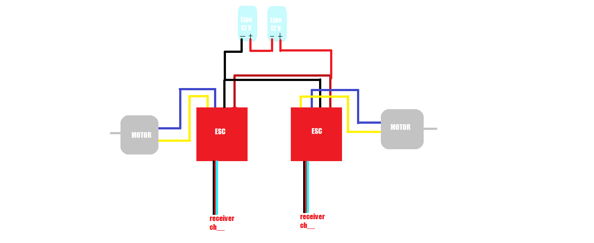

# Battel-Bot
  This is build for an open competition, like a fight to death, where one manual robot has to destroy other in the game arena, the Akhada. The size of robot will be 60 cm * 60 cm * 75 cm and 35 kg weight limit, so that  participants can showcase their creativity with bigger dimensions . This battel-bot was build for CNIYEF Nepal Start-Up Fest

# OBJECTIVE
  - Create a fully functional Battel-bot

# Materials
* ELECTRONICS
  - Three 12V brushed ESC 
  - Three 12V 2400MAH LIPO battery
  - Three planetary motor
  - WIRE
  - RC transmitter and receiver flysky
* MECHANICAL
  - Aluminium plate
  - Screws

# CIRCUITS
  ***Circuit For battel-bot***
 
  - Two 12V lipo is connected in series and supplied to ESC's.
  - Each Esc is connected to respective planetary motor.
  - Esc is also connected to receiver in respective channel as shown in figure.
  
  **Circuit For Weapon**
 
  - 12V lipo is supplied to esc.
  - Esc is connected to weapon planetory motor.
  - Esc is also connected to receiver in respective channel as shown in figure.

  

# References
1. [Rule book](https://docs.google.com/document/d/1i8o3KMpJuj66WfEFxOPjt05z0nmYZktlvZgT35JO4Tc/edit)