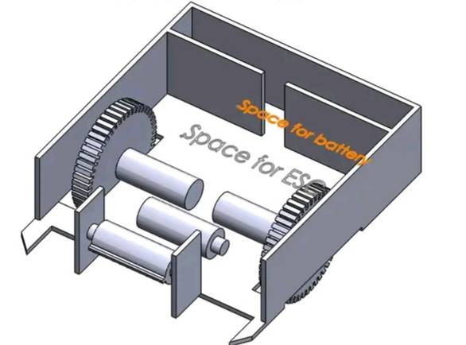
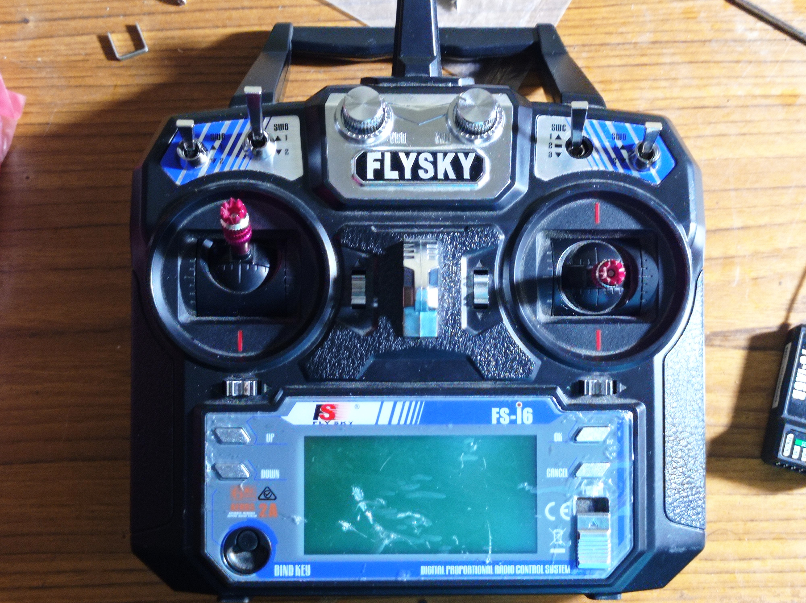
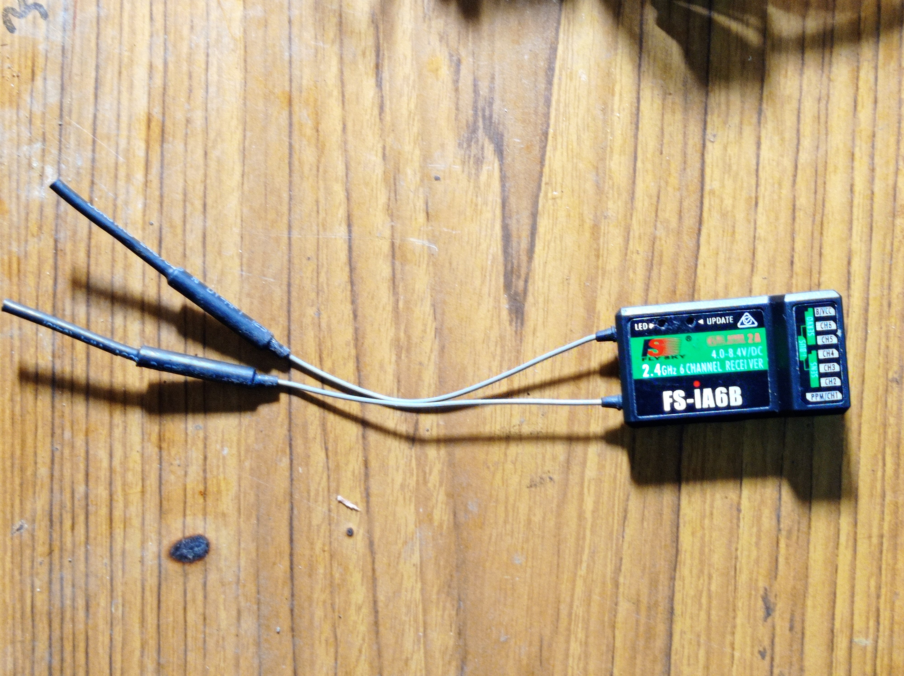
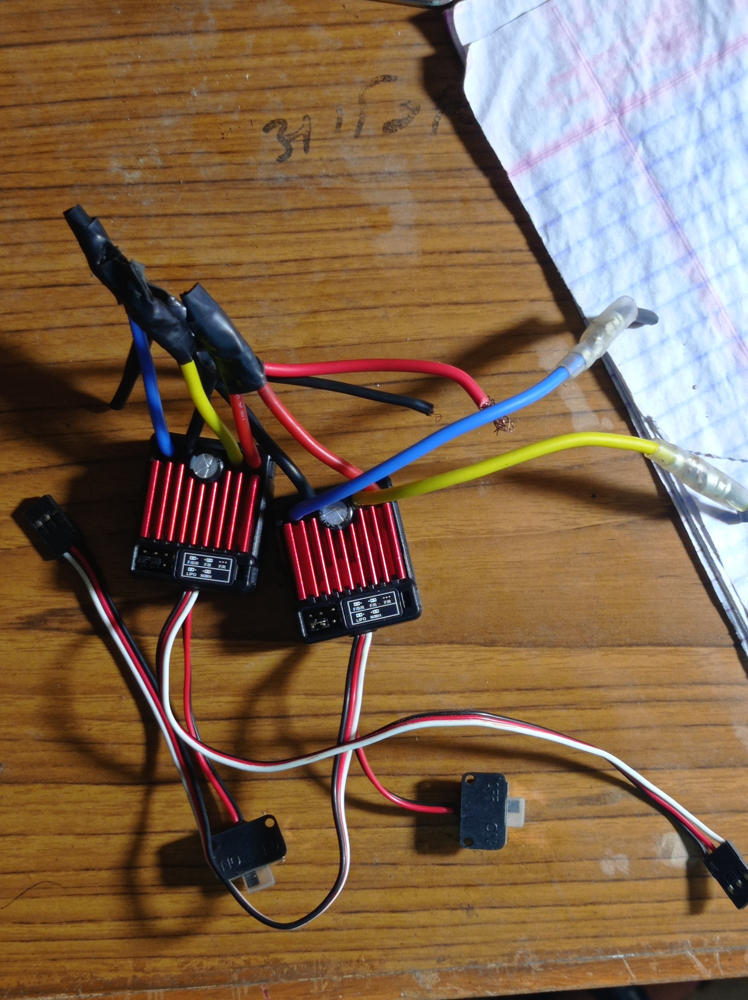
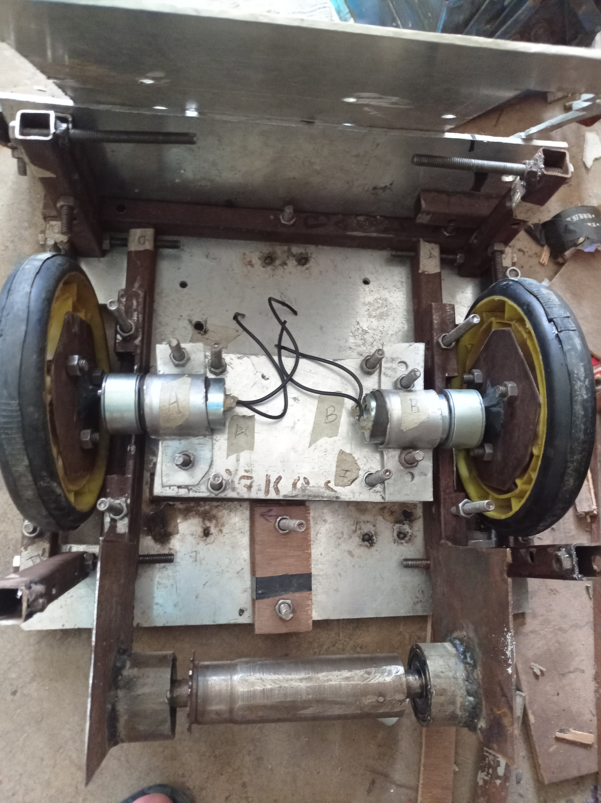
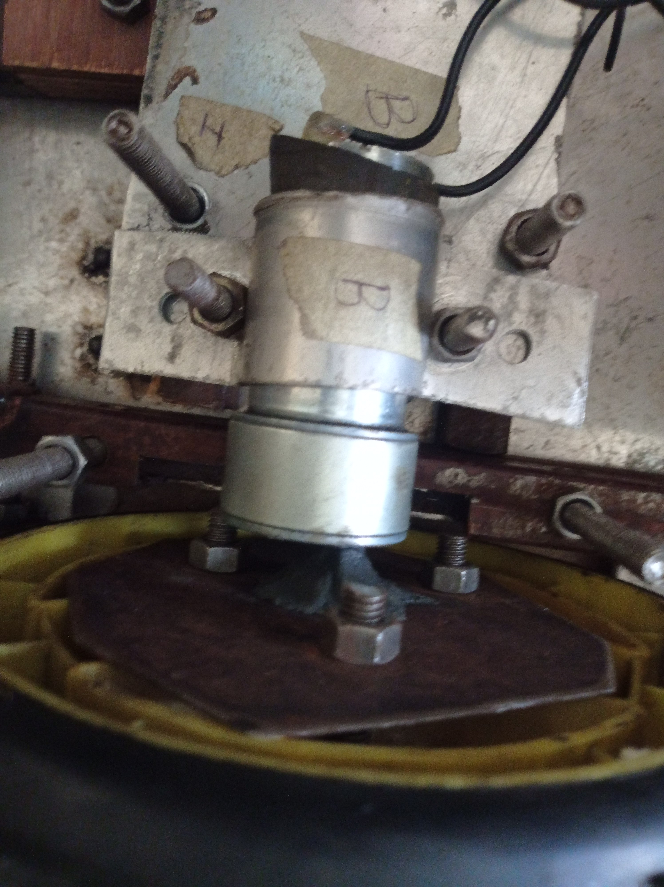

# Battel-Bot
  This is build for an open competition, like a fight to death, where one manual robot has to destroy other in the game arena, the Akhada. The size of robot will be 60 cm * 60 cm * 75 cm and 35 kg weight limit, so that  participants can showcase their creativity with bigger dimensions . This battel-bot was build for CNIYEF Nepal Start-Up Fest

# OBJECTIVE
  - Create a fully functional Battel-bot

# Materials
* ELECTRONICS
  - Three 12V brushed ESC 
  - Three 12V 2400MAH LIPO battery
  - Three planetary motor
  - WIRE
  - RC transmitter and receiver flysky
* MECHANICAL
  - Aluminium plate
  - Screws
  - Nut and bolt
  -  Rectangular pipe
  -  Iron plate ( to hold the weapon )
  -  Solid rod for weapon

# CIRCUITS
  ***Circuit For battel-bot***
 
  - Two 12V lipo is connected in series and supplied to ESC's.
  - Each Esc is connected to respective planetary motor.
  - Esc is also connected to receiver in respective channel as shown in figure.
  
  **Circuit For Weapon**
 
  - 12V lipo is supplied to esc.
  - Esc is connected to weapon planetory motor.
  - Esc is also connected to receiver in respective channel as shown in figure.

# Processes used:
* Mechanical
  1. Metal  cutting
  2. Drilling
  3. Turning
  4. Welding
  5. Grinding
* Electronics
  1. RC car circuit connection according to the figure provided above.
  2. Circuit connection for weapon.
  3. Assigning channel in reciver.
  4. Proper calibration of transmitter.
# Problems and conclusion
## Problems faced while making the robot:
1. Lack of planning and research.
2. Frequent Change in design due to change in components.
3. Late completion of robot.

## Problems faced in competitions:
1. Our robot was too heavy for proper mobility.
2. Problem in wheel mobility.
3. Use of cycle chain in weapon.

## Conclusion:
- Make proper research about rules and guidelines for the competition.
- Complete the robot 3-4 days ahead and practice.
- Take ideas but never depend on anyone.
- Do proper *Research , Material selection ,  Design , Simulation , and Center of gravity calibration* and don't change anything once Mechanical work starts.
- And lastly if lost, don't be hopeless know your worth think about the things you learned during the process and be happy you got this opportunity.🙂

# Process to be followed:
1. Research
2. Material selection
3. Design , Simulation , and Center of gravity calibration
4. Mechanical work
5. Electronics work
6. Practice !!!
7. Documentation
>**NOTE:** *It takes month to complete a perfect battel_bot for competition.*

# Photos
## 3D model of bot
  
## Flysky transmitter

## Reciver

## ESC

## Chasis

## Wheel

## References
1. [Rule book](https://docs.google.com/document/d/1i8o3KMpJuj66WfEFxOPjt05z0nmYZktlvZgT35JO4Tc/edit)
2. [Tutorial](https://www.riobotz.com/riobotz-combot-tutorial?fbclid=IwAR3SMJgoPXp4aXv4JR1GYX6ps02dWtirXms9fp63OoifXVyNJ6T_3FrTjWs)